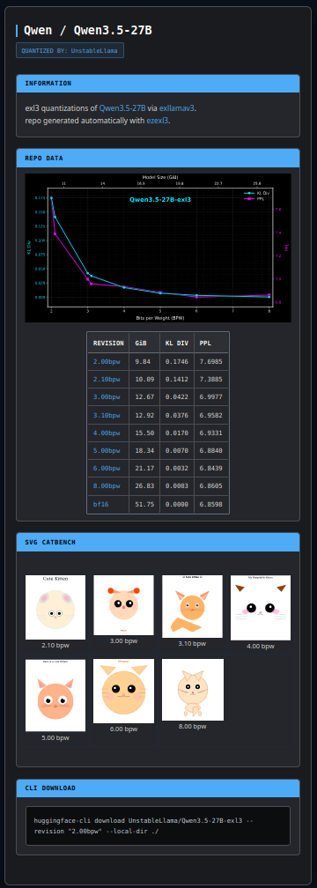
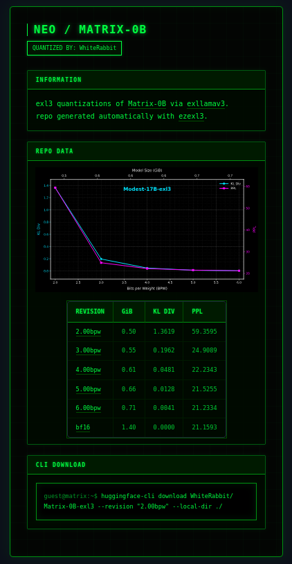
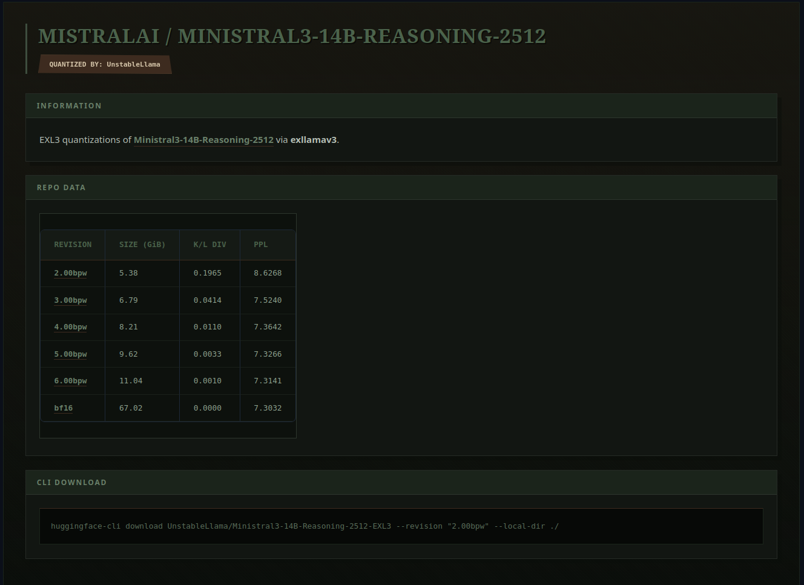

# ezexl3

**ezexl3** is a simple, single-command [exl3](https://github.com/turboderp-org/exllamav3) repo generator.

It wraps the exllamav3 quantization and evaluation workflow into a tool that:
- Runs batch quantization easily (resume / skip supported)
- Measures PPL + KL div, recording data to CSV
- Generates a HuggingFace-ready `README.md` with your measurements using customizable templates
- Embeds an SVG graph from the merged measurement CSV in the README

all with one command.

---

## Installation

This tool requires a local installation of [exllamav3](https://github.com/turboderp-org/exllamav3).

```bash
# 1. Make sure you have exllamav3 installed.

# 2. Clone and install ezexl3
git clone https://github.com/UnstableLlama/ezexl3
cd ezexl3
pip install -e .
```

---

## Usage

### 1. Quantize a full repository
Run the entire pipeline (quantize -> measure -> README):
```bash
ezexl3 repo -m /path/to/base_model -b 2,3,4,5,6 -d 0,1 -t basic
```
Then ezexl3 automatically:

- Quantizes the model to all indicated bitrates, saved under subdirectories in the base model folder.

- Measures PPL and KL div and saves to a modelMeasured.csv in the base model folder, and makes a stylish dark mode SVG graph with the data.

- Generates a README.md for a HuggingFace exl3 quantization repo in the base model folder. (with optional customizable templates)

### 2. Standalone subcommands
If you only want to run specific stages:
```bash
# Quantize only
ezexl3 quantize -m /path/to/base_model -b 2,3,4,5,6 -d 0,1

# Measure only
ezexl3 measure -m /path/to/base_model -b 2,3,4,5,6 -d 0,1

# Generate README only (from existing CSV)
ezexl3 readme -m /path/to/base_model -t fire
```

### 3. Template System
You can customize the generated README by providing a template name via `--template` or `-t`. Templates are stored in the `templates/` directory.

The system is flexible with naming. For example, `-t fire` will search for:
- `templates/fire.md`
- `templates/fireTemplateREADME.md`
- `templates/fireREADME.md`
- `templates/fireTemplate.md`

If no template is specified, it defaults to `basicTemplateREADME.md`.

**Easily generate your own custom template with AI assistance!**

Copy and paste any TemplateREADME.md into your favorite LLM (Gemini, Claude, ChatGPT) along with this example prompt, followed by your own description:

```bash
Take this template, keep the main layout and variables, and modify it aesthetically based on my following prompts. Preserve all of the labels and title strings, only change the aesthetic, not the words or numbers:

*Make it dark and understated, high contrast, professional, metallic.*
```
Then save the resulting output in /ezexl3/templates/ as mynewTemplateREADME.md

Use your template with

```bash
ezexl3 repo -m /path/to/base_model -t mynew -b 2,3,4,5,6 -d 0,1
```
<p align="center">
  
  
  
  
</p>

### 4. Advanced: Passthrough Flags
You can pass custom arguments directly to the underlying quantization (`multiConvert`) or measurement scripts using the `--quant-args` and `--measure-args` flags.

**Important**: These flags require a double-dash `--` delimiter to separate the passthrough block from the rest of the arguments.

```bash
# Pass custom calibration dataset to quantization
ezexl3 repo -m /path/to/model -b 4.0 --quant-args -- -pm

# Pass custom rows/device settings to measurement
ezexl3 repo -m /path/to/model -b 4.0 --measure-args -- -r 200 -d 0
```

Common Use Cases:
- **Quantization**: `-pm` (MoE speedup), `-ss` (shard size), `-nr` (no-rope-scaling).
  If using `-r/--device-ratios`, provide one positive ratio per device in `-d/--devices`.
- **Measurement**: `-r` / `--rows` (number of rows for PPL), `-d` / `--device` / `--devices` (specific evaluation device list).

Note: passthrough blocks consume remaining args until another passthrough block starts, so keep normal CLI flags (like `--no-readme`) before `--measure-args -- ...`.

Deprecated/legacy flags:
- `--exllamav3-root` is deprecated and ignored.
- `repo --schedule` currently supports queue behavior only (`--schedule static` is accepted but ignored).
- `repo --no-meta` is accepted but currently ignored.

### 5. Headless Mode
For automated pipelines, use the `--no-prompt` (or `-np`) flag to skip interactive metadata collection for the README. It will use sensible defaults based on the model directory name and your environment.

```bash
ezexl3 repo -m /path/to/model -b 4.0 --no-prompt
```
