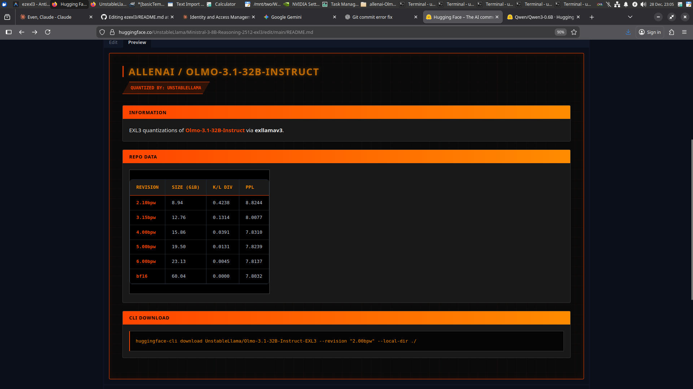
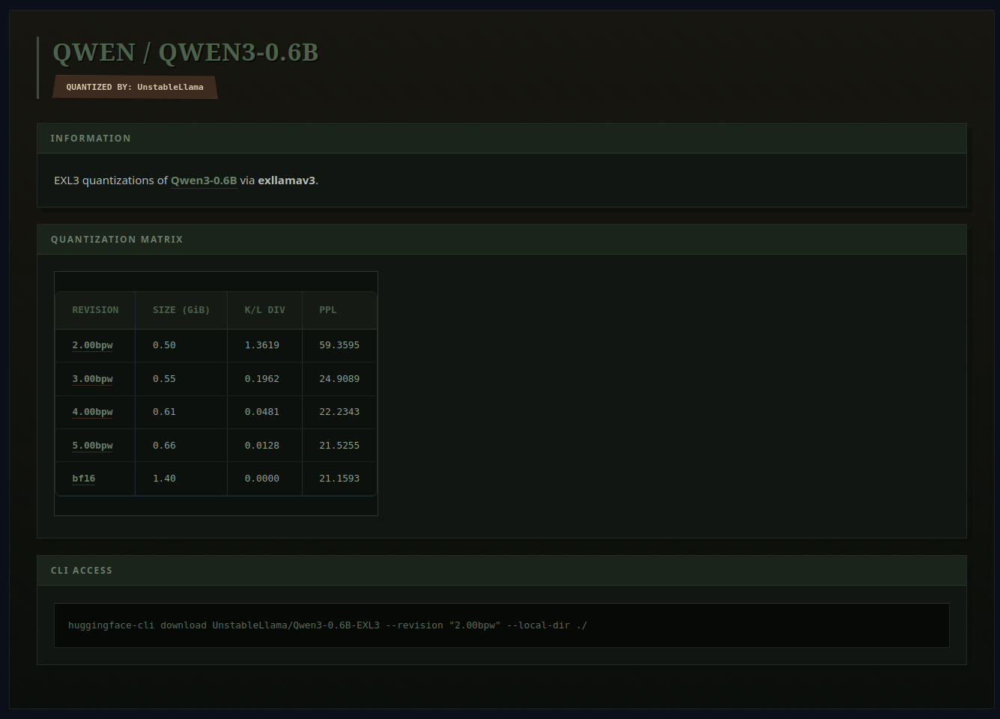

# ezexl3

**ezexl3** is a simple, single-command EXL3 repo generator.

It wraps the EXL3 quantization and evaluation workflow into a tool that:
- Runs batch quantization easily (resume / skip supported).
- Measures PPL + KL div, recording data to CSV.
- Automatically generates HuggingFace-ready `README.md` with your measurements using customizable templates,

all with one command.

---

## Installation

Since `exllamav3` is not yet on PyPI, you should install it along with `ezexl3`:

```bash
# 1. Clone and install exllamav3
git clone https://github.com/turboderp/exllamav3
pip install ./exllamav3

# 2. Install ezexl3
git clone https://github.com/UnstableLlama/ezexl3
pip install ./ezexl3
```

---

## Usage

### 1. Quantize a full repository
Run the entire pipeline (quantize -> measure -> README):
```bash
ezexl3 repo -m /path/to/base_model -b 2,3,4,5,6 -d 0,1
```

### 2. Standalone subcommands
If you only want to run specific stages:
```bash
# Quantize only
ezexl3 quantize -m /path/to/base_model -b 2,3,4,5,6 -d 0,1

# Measure only
ezexl3 measure -m /path/to/base_model -b 2,3,4,5,6 -d 0,1

# Generate README only (from existing CSV)
ezexl3 readme -m /path/to/base_model -t fire
```

### 3. Template System
You can customize the generated README by providing a template name via `--template` or `-t`. Templates are stored in the `templates/` directory.

The system is flexible with naming. For example, `-t fire` will search for:
- `templates/fire.md`
- `templates/fireTemplateREADME.md`
- `templates/fireREADME.md`
- `templates/fireTemplate.md`

If no template is specified, it defaults to `basicTemplateREADME.md`.

**Easily generate your own custom template with AI assistance!**

Copy and paste any TemplateREADME.md into your favorite LLM (Gemini, Claude, ChatGPT) along with this example prompt, followed by your own description:

```bash
Take this template, keep the main layout and variables, and modify it aesthetically based on my following prompts? Preserve all of the labels and title strings, only change the aesthetic, not the words or numbers:

*Make it dark and understated, high contrast, professional, metallic.*
```
Then save the resulting output in /ezexl3/templates/ as mynewTemplateREADME.md

Use your template with

```bash
ezexl3 repo -m /path/to/base_model -t mynew -b 2,3,4,5,6 -d 0,1
```
<p align="center">
  
  
  
  
</p>

### 4. Advanced: Passthrough Flags
You can pass custom arguments directly to the underlying quantization (`multiConvert`) or measurement scripts using the `--quant-args` and `--measure-args` flags.

**Important**: These flags require a double-dash `--` delimiter to separate the passthrough block from the rest of the arguments.

```bash
# Pass custom calibration dataset to quantization
ezexl3 repo -m /path/to/model -b 4.0 --quant-args -- -pm

# Pass custom rows/device settings to measurement
ezexl3 repo -m /path/to/model -b 4.0 --measure-args -- -r 200 -d 0
```

Common Use Cases:
- **Quantization**: `-pm` (MoE speedup), `-ss` (shard size), `-nr` (no-rope-scaling).
- **Measurement**: `-r` (number of rows for PPL), `-d` (specific evaluation device).

### 5. Headless Mode
For automated pipelines, use the `--no-prompt` (or `-np`) flag to skip interactive metadata collection for the README. It will use sensible defaults based on the model directory name and your environment.

```bash
ezexl3 repo -m /path/to/model -b 4.0 --no-prompt
```

## Key Features
- **Quantization Queuing**: Run multiple quantizations at a time with one command.
- **Auto-Measure**: Automatically measure and record K/L div and PPL asynchronously.
- **Resume Support**: Skip already-finished BPWs and resume partial jobs.
- **Flexible README Templates**: Automated high-quality README generation for HuggingFace uploads.
- **Headless Mode**: Optional `--no-prompt` flag for fully automated README generation.
- **Automatic Cleanup**: Default cleanup of temporary working directories and logs.

## Development Status
- ✅ Quantization: Stable, supports resume and multi-GPU ratios.
- ✅ Measurement: Stable, sharded multi-GPU execution.
- ✅ README Generation: Flexible template system with standalone subcommand.
- ✅ Cleanup: Automatic cleanup (toggle with `--no-cleanup`).

## Todo
- Jupyter Notebook
- WebUI
