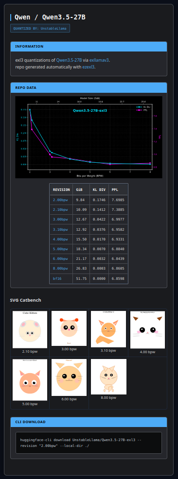
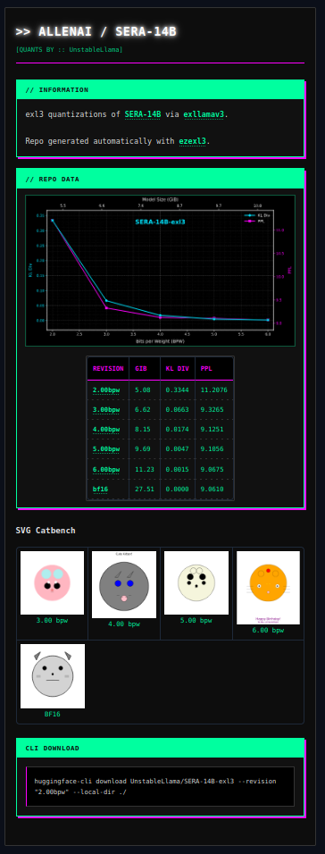
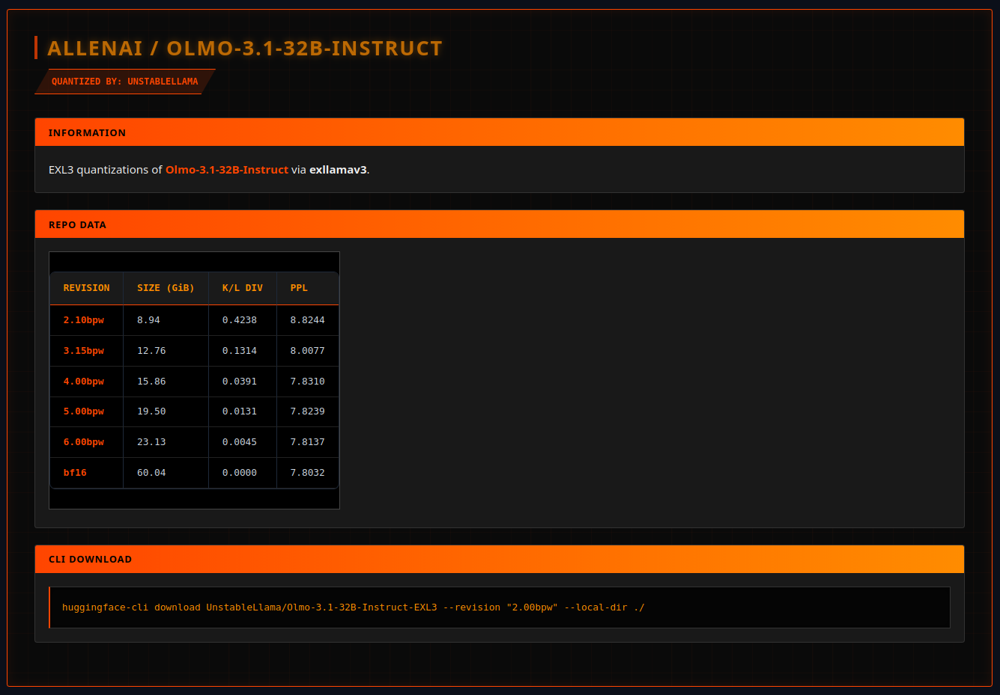
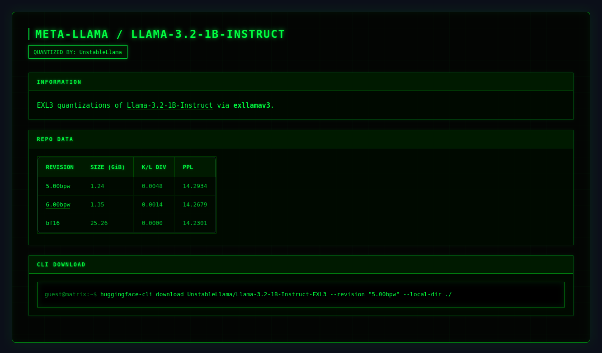

# ezexl3

**ezexl3** is a single-command quantization and measurement pipeline that generates high-quality, HuggingFace-ready exl3 repos automatically.

It wraps the exllamav3 quantization and evaluation workflow into a tool that has:
- Runs batched quantization (multi-gpu supported)
- Supports optimized BPWs, (2.1 bpw, 3.5 bpw etc.)
- Measures KL divergence + PPL @ 200k tokens, recording data to CSV
- Generates a HuggingFace-ready `README.md` with your measurements using customizable templates
- Embeds an SVG graph from the measurement CSV in the README
- Checkpoints and resumes intelligently
all from one command.

# Pipeline:
<p align="center">
model → quantize → optimize → measure (KL + PPL) → graph → README
</p>

---

## Installation

This tool requires a local installation of [exllamav3](https://github.com/turboderp-org/exllamav3).

```bash
# 1. Make sure you have exllamav3 installed.

# 2. Clone and install ezexl3
git clone https://github.com/UnstableLlama/ezexl3
cd ezexl3
pip install -e .
```

---

## Usage

### 1. Quantize a full repository
Run the entire pipeline (quantize → measure → README):
```bash
ezexl3 repo -m /path/to/base_model -b 2,2.5,3,4,5,6 -d 0,1 -t basic
```
Then ezexl3 automatically:

- Quantizes the model to all indicated bitrates, saved under subdirectories in the base model folder.

- Measures PPL and KL div and saves to modelNameMeasured.csv in the base model folder, and makes a stylish dark mode SVG graph with the data.

- Generates a README.md for a HuggingFace repo in the base model folder. (with optional customizable templates)

### 2. Single-stage subcommands
If you only want to run specific stages:
```bash
# Quantize only
ezexl3 quantize -m /path/to/base_model -b 2,2.5,3,4,5,6 -d 0,1

# Quantize with optimized target (automatically ensures integer neighbors)
ezexl3 repo -m /path/to/base_model -b 4.07 -d 0

# Measure only
ezexl3 measure -m /path/to/base_model -b 2,3,4,5,6 -d 0,1

# Generate README only (from existing CSV)
ezexl3 readme -m /path/to/base_model -t fire

(but really everything is checkpointed so it usually doesn't hurt to just run the "repo" command every time)
```

### 3. Template System
You can customize the generated README by providing a template name via `--template` or `-t`.
Templates are stored in the `/ezexl3/templates/` directory.

The system is flexible with naming. For example, `-t fire` will search for:
- `templates/fire.md`
- `templates/fireTemplateREADME.md`
- `templates/fireREADME.md`
- `templates/fireTemplate.md`

If no template is specified, it defaults to `basicTemplateREADME.md`.

**Easily generate your own custom template with AI assistance!**

Copy and paste any TemplateREADME.md into your favorite LLM (Gemini, Claude, ChatGPT) along with this example prompt, followed by your own description:

```bash
Take this template, keep the main layout and variables, and modify it aesthetically based on my following prompts. Preserve all of the labels and title strings, only change the aesthetic, not the words or numbers:

*Make it dark and understated, high contrast, professional, metallic.*
```
Then save the resulting output in /ezexl3/templates/ as mynewTemplateREADME.md

Use your template with

```bash
ezexl3 repo -m /path/to/base_model -t mynew -b 2,3,4,5,6 -d 0,1
```
<p align="center">
  
  
  
  
</p>

### 4. Advanced: Passthrough Flags
You can pass custom arguments directly to the underlying quantization (`multiConvert`) or measurement scripts using the `--quant-args` and `--measure-args` flags.

**Important**: These flags require a double-dash `--` delimiter to separate the passthrough block from the rest of the arguments.

```bash
# Pass custom calibration dataset to quantization
ezexl3 repo -m /path/to/model -b 4.0 --quant-args -- -pm

# Pass custom rows/device settings to measurement
ezexl3 repo -m /path/to/model -b 4.0 --measure-args -- -r 200 -d 0
```

Common Use Cases:
- **Quantization**: `-pm` (MoE speedup)
- **Measurement**: `-r` / `--rows` (number of rows for PPL)

Note: passthrough blocks consume remaining args until another passthrough block starts, so keep normal CLI flags (like `--no-readme`) before `--measure-args -- ...`


### Optimized BPW workflow

If you request a optimized BPW (for example `4.07`), ezexl3 now executes the following order:

1. Detect optimized targets and remove them from the initial integer quant queue.
2. Ensure required neighboring integers exist in the quant queue (`4` and `5` for `4.07`).
3. Run normal integer quantization.
4. Run exllamav3 `util/measure.py` in a dynamic multi-GPU queue for required integer pairs (resume-safe: skips if `measurements/<low>-<high>_measurement.json` exists), with terminal logs when jobs are assigned and completed per GPU.
5. Run exllamav3 `util/optimize.py` to build the optimized output directory.
6. Run normal ezexl3 KL/PPL measurement over all produced targets (integers + optimizeds).

To locate exllamav3 utility scripts robustly, ezexl3 attempts runtime package discovery and supports overriding with:

```bash
EXLLAMAV3_ROOT=/path/to/exllamav3 ezexl3 repo -m /path/to/model -b 4.07
```

### 5. Headless Mode
For automated pipelines, use the `--no-prompt` (or `-np`) flag to skip interactive metadata collection for the README. It will use sensible defaults based on the model directory name and your environment.

```bash
ezexl3 repo -m /path/to/model -b 4.0 --no-prompt
```
