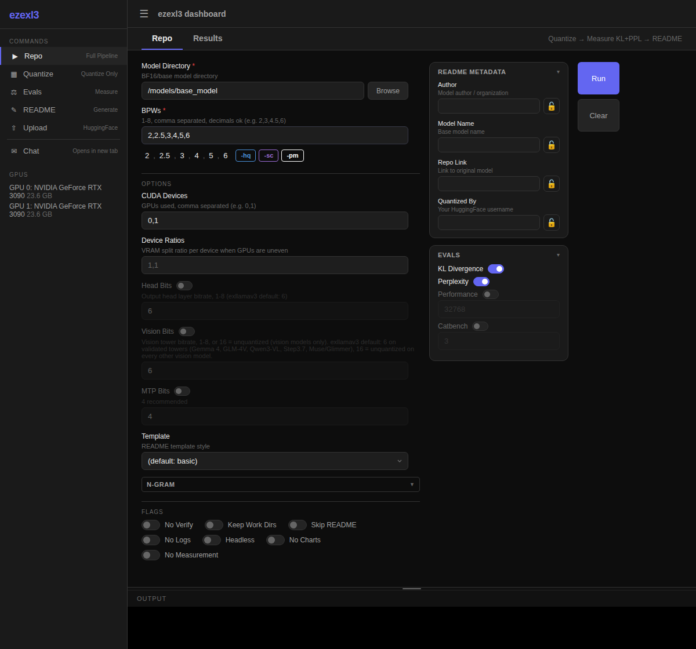
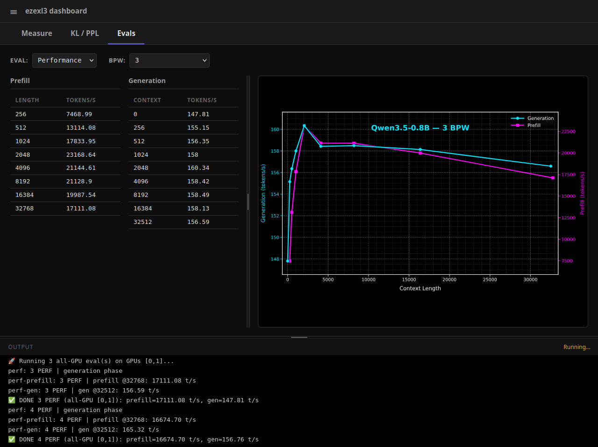
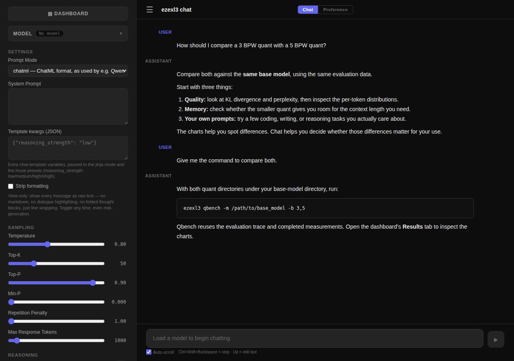
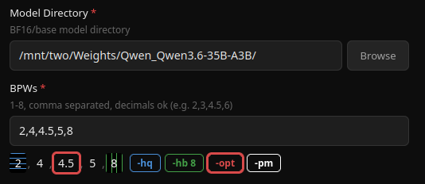
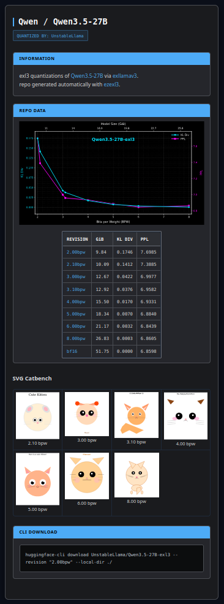
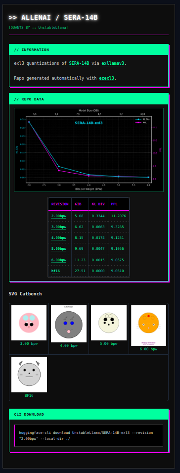
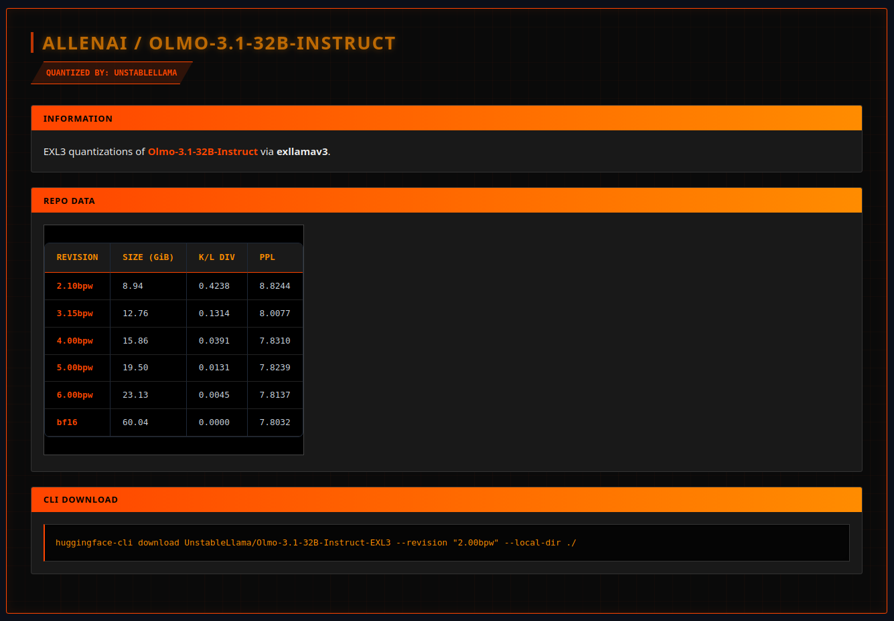
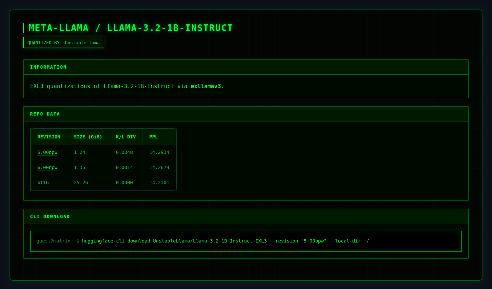

# ezexl3

**ezexl3** is a simplified interface for exllamav3: quantize, verify, benchmark, visualize, upload, and chat. One pip install, one CLI.

```bash
pip install ezexl3
```

or for custom templates, use a local editable install

```bash
git clone https://github.com/UnstableLlama/ezexl3/
cd ezexl3
pip install -e .
```


Requires a local installation of [exllamav3](https://github.com/turboderp-org/exllamav3).

---

## Quick Start

### Dashboard
```bash
ezexl3 ui
```
Launches a web dashboard on port 8801. Every CLI subcommand is a clickable form with live terminal output via SSE streaming. Real-time measurement table and SVG graph update as your quant runs. GPU auto-detection. Boolean arguments exposed as toggles. This is the easiest way to use ezexl3.

<p align="center">
  

</p>

The Evals tab shows perf measurements (prefill and generation tokens/s across context lengths) on a dual-axis chart, and the catbench gallery if you ran one. Switch between BPWs with the dropdown.

<p align="center">
  
</p>

### Chat
```bash
ezexl3 chat
```
Launches a lightweight chat web interface for testing quantized models. Browse to your model in the file picker, select GPUs, click load. Branching conversation tree with regeneration, message editing, and sibling navigation. Exllama native, based on chat.py and the generator. No CLI flags needed.

Supports multi-GPU (`-d 0,1`), configurable sequence length (cache is sized 2x behind the scenes), and cache quantization (`-cq 6,6`). Auto-detects prompt format from the model name. Useful for spot-checking quant quality at different BPW levels before uploading.

Speculative decoding is available through the draft model field (DFlash or any smaller draft model), or via the MTP checkbox for models with a built-in MTP head (Qwen3.5+, requires an exllamav3 build with MTP support) — equivalent to exllamav3's `--mtp` flag.

<p align="center">
  
</p>

### CLI Pipeline
Run the full pipeline from the command line:
```bash
ezexl3 repo -m /path/to/base_model -b 2,2.5,3,4,5,6 -d 0,1 -t basic
```

---

## What the pipeline does

ezexl3 wraps the exllamav3 quantization and evaluation workflow into a single command that:
- Interleaves quantize → verify per BPW: each BPW is quantized then immediately verified (KL + PPL) before proceeding, halting on error
- Multi-GPU acceleration for both quantization and verification. KL and PPL run in parallel on 2+ GPUs
- Supports optimized BPWs (2.1 bpw, 3.5 bpw etc.)
- Measures KL divergence + PPL @ 200k tokens, recording data to CSV
- Optional perf measurement (prefill and generation tokens/s across context lengths) with its own SQLite database
- Generates a HuggingFace-ready `README.md` with your measurements using customizable templates
- Embeds an SVG graph from the measurement CSV in the README
- Optional catbench integration. Generates SVG kitten drawings at each BPW and assembles them into a grid
- Optional HuggingFace upload, with metadata locks and a dry-run preview before any repos are created
- Checkpoints and resumes intelligently

```
model → [quantize → verify KL+PPL] per BPW → optimize → evals → graph → README → upload
```

---

### Single-stage subcommands
If you only want to run specific stages:
```bash
# Quantize only
ezexl3 quantize -m /path/to/base_model -b 2,2.5,3,4,5,6 -d 0,1

# Quantize with optimized target (automatically ensures integer neighbors)
ezexl3 repo -m /path/to/base_model -b 4.07 -d 0

# Measure only
ezexl3 measure -m /path/to/base_model -b 2,3,4,5,6 -d 0,1

# Generate README only (from existing CSV)
ezexl3 readme -m /path/to/base_model -t fire

# Quantize just the MTP tensors (adds speculative decoding to legacy quants)
# -hq raises the bitrate of select MTP layers, matching the integrated conversion's -hq
ezexl3 mtp -m /path/to/base_model -mb 4 -d 0

# Upload to HuggingFace (dry-run by default)
ezexl3 upload -m /path/to/base_model

(but really everything is checkpointed so it usually doesn't hurt to just run the "repo" command every time)
```

### Per-BPW Paint Flags
The dashboard exposes four paint buttons that toggle quantization flags on individual BPW tokens. Click a button, then click a BPW in the parsed-token row to apply it:

- `-hq` — high-quality boost, useful on low BPWs where the head needs the extra precision
- `-sc` — self-calibrated quants (see below); works on any BPW, integer or decimal
- `-opt` — opt-in optimized fractional pipeline (only applies to fractional BPWs)
- `-pm` — global MoE speedup, applies to all BPWs at once
<p align="center">
  
</p>
The same flags work from the CLI via `--quant-args`, but the dashboard is faster for mixing them across BPWs.

Head and vision bitrates are plain numeric options rather than paints:

- `-hb N` / **Head Bits** box — output head layer bitrate, 1-8 (exllamav3 default: 6)
- `-vb N` / **Vision Bits** box — vision tower bitrate, 1-8, or 16 to store unquantized (vision models only)

(The old `-hb8` paint flag still works from the CLI, but `-hb` takes precedence when both are given.)

For PLE models with a hashed n-gram embedding table (e.g. Qwen3.8-Flash-Next), the dashboard's collapsed **N-gram** block (and the matching CLI flags) controls how the table is quantized (exllamav3 >= 1.4.5 required; ignored by models without a table):

- `-ngb N` / **N-gram Bits** box — bits per weight for the n-gram table, 1-8 (exllamav3 default: target BPW rounded)
- `-ngf FILE` / **N-gram File** box — reuse a pre-quantized table (from exllamav3's `util/convert_ngram.py`) instead of quantizing it again; handy when producing several BPWs that should share one table

### Self-Calibrated Quants (`-sc`)
BPWs painted with `-sc` are built through exllamav3's experimental optimization pipeline
(exllamav3 >= 1.4.3 required) instead of the uniform allocation:

1. the model generates its own in-domain calibration trace (using an existing >= 5 bpw quant
   as the sampler when one is available, otherwise the unquantized model),
2. an existing integer quant (lowest available) is probed for per-tensor quantization error,
3. per-tensor sensitivity is measured on the unquantized model with shaped noise injection,
4. a per-tensor bitrate recipe is compiled for each `-sc` BPW, and
5. each BPW is converted with the recipe (`-rcp`) and the self-sampled calibration data (`-cd`).

Every stage writes plain files under `<model>/selfcal/` and is skipped on re-runs when its
output already exists, so interrupted pipelines resume. Sensitivity measurement holds the
unquantized model plus per-layer Hessians on one GPU, so it needs the most VRAM of any stage.

```bash
# 2.5 and 3.14 bpw self-calibrated, 4 and 6 bpw standard, 4-bit head everywhere
ezexl3 repo -m /path/to/base_model -b 2.5,3.14,4,6 -sc 2.5,3.14 -hb 4 -d 0,1
```

### Template System
You can customize the generated README by providing a template name via `--template` or `-t`.
Templates are stored in the `/ezexl3/templates/` directory — just use the short name:

```bash
ezexl3 repo -m /path/to/base_model -t fire -b 2,3,4,5,6 -d 0,1
```

If no template is specified, it defaults to `basic`.

**Easily generate your own custom template with AI assistance!**

Copy and paste any template from `/ezexl3/templates/` into your favorite LLM (Gemini, Claude, ChatGPT) along with this example prompt, followed by your own description:

```bash
Take this template, keep the main layout and variables, and modify it aesthetically based on my following prompts. Preserve all of the labels and title strings, only change the aesthetic, not the words or numbers:

*Make it dark and understated, high contrast, professional, metallic.*
```
Then save the result in `/ezexl3/templates/` and use it with `-t yourname`.
<p align="center">
  
  
  
  
</p>

###  Catbench
SVG Catbench is available as a measurement option via the `-cb` flag. It runs catbench inference at every BPW level (including optimized fractionals), extracts SVGs, and assembles them into a grid in the final README.

```bash
ezexl3 repo -m /path/to/base_model -b 2,3,4,5,6,8 -d 0,1 -t punk -cb
```

- `-cb` alone runs 3 samples per BPW (default), `-cb 5` runs 5
- Catbench runs as a batch pass after KL/PPL/perf complete, using the multi-GPU queue
- VRAM pre-flight check before each catbench load — skips gracefully if model won't fit, automatically uses multi-GPU for large models
- Best valid SVG is selected from N samples for the grid
- SVG extraction and grid assembly happen in a batch pass after all inference completes
- Catbench results are checkpointed like everything else — rerunning skips completed samples
- bf16 baseline included when VRAM allows

###  HuggingFace Upload
The Upload tab (or `ezexl3 upload`) creates HuggingFace repos for your quants. Defaults to dry-run mode so you see exactly what repo names will be created before anything is published.

```bash
# Preview what would be created
ezexl3 upload -m /path/to/base_model

# Actually create and upload
ezexl3 upload -m /path/to/base_model --no-dry-run
```

- Single mode (default): one standalone repo per BPW, named `MODEL-exl3-BPW`. Recommended.
- Branched mode: one repo with each BPW as a separate branch. Note that HuggingFace's download counter does not count branches — branched repos show only the main branch's downloads. Standalone repos preserve your download numbers.
- Metadata fields (Author, Model Name, Repo Link, Quantized By) lock during the README write phase so the values can't drift mid-pipeline.
- Preflight check verifies your HF token before any repos are created.

### Inference Evaluation with WebUI
ezexl3 includes a lightweight chat web interface for quickly testing quantized models. Exllama native, based on chat.py and the generator.

```bash
ezexl3 chat -m /path/to/quantized_model -d 0
```

### Advanced: Passthrough Flags
You can pass custom arguments directly to the underlying quantization (`multiConvert`) or measurement scripts using the `--quant-args` and `--measure-args` flags.

**Important**: These flags require a double-dash `--` delimiter to separate the passthrough block from the rest of the arguments.

```bash
# Pass custom calibration dataset to quantization
ezexl3 repo -m /path/to/model -b 4.0 --quant-args -- -pm

# Pass custom rows/device settings to measurement
ezexl3 repo -m /path/to/model -b 4.0 --measure-args -- -r 200 -d 0
```

Common Use Cases:
- **Quantization**: `-pm` (MoE speedup)
- **Measurement**: `-r` / `--rows` (number of rows for PPL)

Note: passthrough blocks consume remaining args until another passthrough block starts, so keep normal CLI flags (like `--no-readme`) before `--measure-args -- ...`

###  `--no-verify` (Legacy Batch Mode)
By default, ezexl3 interleaves quantization with KL/PPL verification per BPW. Use `--no-verify` (or `-nv`) to revert to the old batch pipeline (all quants first, then all measurements):

```bash
ezexl3 repo -m /path/to/model -b 2,3,4,5,6 -d 0,1 --no-verify
```

This is useful if you're confident in your quantization setup and want to let everything run unattended without per-BPW halting.

### Optimized BPW workflow

If you request an optimized BPW (for example `4.07`), ezexl3 executes the following order:

1. Detect optimized targets and remove them from the initial integer quant queue.
2. Ensure required neighboring integers exist in the quant queue (`4` and `5` for `4.07`).
3. Quantize each integer BPW one at a time, verifying KL+PPL immediately after each (halts on error). With 2+ GPUs, KL and PPL run in parallel during verification.
4. Run exllamav3 `util/measure.py` in a dynamic multi-GPU queue for required integer pairs (resume-safe: skips if `measurements/<low>-<high>_measurement.json` exists), with terminal logs when jobs are assigned and completed per GPU.
5. Run exllamav3 `util/optimize.py` to build the optimized output directory.
6. Verify each optimized BPW with KL+PPL measurement (halts on error).

To locate exllamav3 utility scripts, ezexl3 uses bundled vendored copies (no manual path configuration needed).

###  Headless Mode
For automated pipelines, use the `--no-prompt` (or `-np`) flag to skip interactive metadata collection for the README. It will use sensible defaults based on the model directory name and your environment.

```bash
ezexl3 repo -m /path/to/model -b 4.0 --no-prompt
```
