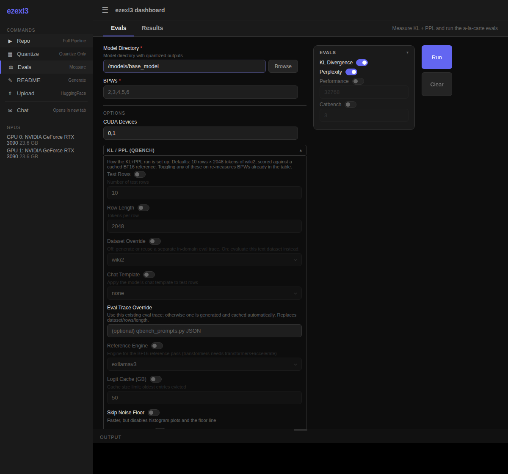
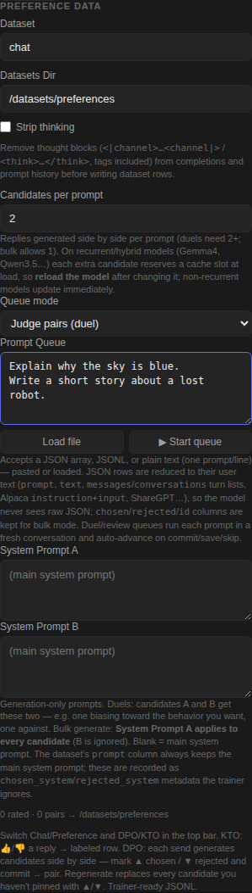

# ezexl3

**Quantize, evaluate, publish, and chat with EXL3 models.**

ezexl3 brings the exllamav3 workflow into one CLI and a local web dashboard. Build several quantizations, compare them against the base model, generate a model card with charts, and upload to Hugging Face. Open chat to try the results, test LoRA adapters, or collect preference data.

Version 1.0.0 adds self-calibrated quantization, qbench evaluation, speculative decoding, CPU offload controls, and KTO/DPO dataset creation.

## Get started

Install ezexl3 into your exllamav3 environment:

```bash
pip install -U ezexl3
```

You need Python 3.10+, a working [exllamav3](https://github.com/turboderp-org/exllamav3) installation, and CUDA GPUs suitable for your model. Dependencies include Transformers 5+, seaborn, and PyYAML. Qbench requires a recent exllamav3 build with its measurement APIs; self-calibration needs 1.4.3+, and PLE n-gram controls need 1.4.5+. Model-specific chat features depend on support in the installed build.

For an editable checkout, including local template customization:

```bash
git clone https://github.com/UnstableLlama/ezexl3/
cd ezexl3
pip install -e .
```

Start the dashboard:

```bash
ezexl3 ui
```

Open `http://127.0.0.1:8801`. Choose a base model directory, enter your target bits per weight (BPW), select GPUs, and run. The dashboard provides command forms, live terminal output, quantization controls, and README metadata fields.

<p align="center">
  
</p>

The **Results** tab brings together the KL/PPL measurement table, qbench charts, performance measurements, and catbench gallery. Use its **Eval** selector to switch views.

Prefer the terminal? Run the same pipeline directly:

```bash
ezexl3 repo -m /path/to/base_model -b 2,2.5,3,4,5,6 -d 0,1 -t basic
```

## From base model to published quants

The default `repo` workflow quantizes each BPW and verifies it with qbench before continuing. A failed verification stops the run. Optional evaluations follow, then ezexl3 generates a model README from the results. Upload is a separate step with a dry-run preview.

```text
Base model → quantize + verify each BPW → optional evals → charts + README → upload
```

Completed stages and measurements are reused on later runs. You can also run stages individually:

| Command | What it does |
| --- | --- |
| `ezexl3 repo` | Quantize, verify, run selected evaluations, and generate a README |
| `ezexl3 quantize` | Build quants at the requested BPWs |
| `ezexl3 measure` | Measure KL/PPL with qbench and run selected evaluations |
| `ezexl3 qbench` | Configure and run quant comparisons against a reference |
| `ezexl3 mtp` | Extract and quantize MTP tensors from a base checkpoint |
| `ezexl3 evals` | Run standalone evaluations |
| `ezexl3 readme` | Regenerate model cards from existing results |
| `ezexl3 upload` | Preview or upload Hugging Face repositories |
| `ezexl3 chat` | Test models and collect preference data |
| `ezexl3 ui` | Open the dashboard |

Use `ezexl3 <command> --help` for the full options.

## Quantization controls

Integer and fractional BPWs are supported. Use `-sc` for the new optimized, self-calibrated quantization workflow.

```bash
# Quantize only
ezexl3 quantize -m /path/to/base_model -b 2,2.5,3,4,5,6 -d 0,1

# Build an optimized, self-calibrated 4.07 BPW quant
ezexl3 repo -m /path/to/base_model -b 4.07 -sc -scd /path/to/6bpw_quant -d 0
```

The dashboard's BPW controls expose `-hq` for selected targets, plus global `-sc` and `-pm` toggles. `-sc` applies self-calibration to every requested BPW in the form; `-pm` enables exllamav3's parallel-module conversion for MoE models. The CLI supports selecting individual BPWs for `-hq` and `-sc`, or using either flag bare to apply it to all targets.

| Option | Control |
| --- | --- |
| `-hb N` | Output head bitrate, 1–8; overrides the older `-hb8` flag |
| `-vb N` | Vision tower bitrate, 1–8, or 16 for unquantized weights |
| `-mb N` | MTP layer bitrate, 1–8, or 16 for unquantized weights |
| `-ngb N` | PLE hashed n-gram table bitrate, 1–8 |
| `-ngf FILE` | Reuse a pre-quantized n-gram table from exllamav3's `util/convert_ngram.py` |

Head, vision, and MTP bitrates have numeric fields in the dashboard. PLE table controls live in its collapsed **N-gram** group.

### Self-calibrated quants

`-sc` is the new way to make optimized, self-calibrated quants at integer or fractional BPWs. It is an in-depth process: the pipeline learns which tensors are most affected by quantization, then uses those measurements to decide how to allocate the final quant's bit budget.

The process has four stages:

1. **Start with a 6 BPW or higher quant.** This is the calibration donor used to generate the model's own calibration data.
2. **Generate 500,000 tokens for self-calibration.** The donor produces a substantial calibration trace for the optimization process.
3. **Measure the relative impact of quantization on each tensor.** Sensitivity measurements identify where reduced precision does the most damage and where fewer bits have less impact.
4. **Build the final quant from those measurements.** The pipeline creates a per-tensor bitrate recipe for each requested BPW and uses it to produce the optimized weights.

The dashboard's **`-sc` button automates the workflow**. With your 6 BPW or higher donor available, choose your targets and enable `-sc`; ezexl3 handles trace generation, sensitivity measurement, recipe creation, and conversion. This is a substantial calibration and measurement run, so expect it to take longer than standard quantization.

```bash
# Self-calibrate selected targets using an existing 6 BPW donor
ezexl3 repo -m /path/to/base_model -b 2.5,3.14,4 -sc 2.5,3.14 -scd /path/to/6bpw_quant -hb 4 -d 0,1

# Self-calibrate every target using an explicit calibration donor
ezexl3 repo -m /path/to/base_model -b 2,3,4 -sc -scd /path/to/6bpw_quant -d 0,1
```

Use **SC Trace Generation Model** in the dashboard or `-scd` / `--sc-donor` on the CLI to select your calibration donor explicitly.

Stages save their work under `<model>/selfcal/`. Sensitivity measurement loads the full model when memory permits or streams one module at a time, keeping activation caches and reference logits in system RAM. With multiple GPUs, independent workers share the measurement work and merge their checkpoints. Completed worker results can be reused after changing GPU count.

Self-calibration remains experimental, and MoE sensitivity measurement remains unvalidated. Streaming still requires the largest module and workspace to fit in VRAM. It adds weight-loading overhead, and each additional worker needs its own RAM caches; multiple GPUs do not pool memory or guarantee linear speedups. Automatic loading can fall back to streaming after an initial OOM, but an OOM later in measurement stops the run.

## Evaluate with qbench

Qbench is the default KL divergence and perplexity backend for `repo` and `measure`. It compares quants against a shared reference, caches completed passes, and produces charts for the dashboard and model README. In the dashboard, open **Evals** and expand **KL / PPL (qbench)** to configure the comparison.

```bash
# Discover BPW subdirectories and compare them against the base model
ezexl3 qbench -m /path/to/base_model

# Use an explicit text dataset
ezexl3 qbench -m /path/to/base_model -b 3,4,5 --dataset wiki2 --template chat

# Use an existing evaluation trace
ezexl3 qbench -m /path/to/base_model --trace /path/to/eval_trace.json
```

<p align="center">
  
</p>

Results include mean, median, and p90 KLD, buckets by reference confidence, and perplexity. A second reference pass measures the BF16 self-noise floor, giving small differences between quants some context. Charts show KL/PPL versus BPW and per-token KL distributions, including a combined distribution plot with the noise baseline.

By default, qbench generates a separate in-domain evaluation trace with the vendored `qbench_prompts.py`. It uses the highest completed quant at 5 BPW or above, or the base model when none exists. The generation defaults target 20,000 response tokens, with a 4,096-token cap per turn and a 0.3 tool-conversation fraction. The base-model fallback requires enough memory for a full generation load.

Trace generation can split across the GPUs selected with `measure -d`; qbench's streamed comparison passes use the first GPU. The trace is saved as `<model>/qbench/qbench_prompts_gen.json` and reused across quants and later runs. An existing trace at `<model>/qbench_prompts_gen.json` is also recognized. Self-calibration's `selfcal/cal_trace.json` is not automatically reused for evaluation.

Trace mode scores response positions and ignores `--rows`, `--length`, and `--template`. Choose `--dataset wiki2` or `--dataset openwebtext` to evaluate text instead. Failed trace generation stops the run rather than silently changing datasets.

### Caches and custom comparisons

The generated `<model>/qbench/project.yml` is preserved across runs. Edit it to add GGUF entries with `engine: llamacpp` or Hugging Face checkpoints with `engine: transformers`, using the corresponding engine dependencies. Explicit `--dataset` and `--trace` options update the test source; `--regen` rewrites the project while retaining matching cached measurements and the generated trace.

Keep `<model>/qbench/logit_cache/qbench/`: it holds keyed checkpoints for completed model passes, including the reference and noise floor. Adding a BPW measures the new quant; an interrupted pass restarts. `qb_results.json` and CSV exports alone cannot replace the cache. Changed model files or test settings invalidate the corresponding entries.

Saved measurements can regenerate reports even after reference logits are evicted. Adding a new quant then rebuilds those logits as needed. `--cache-gb` caps the reference-logit cache; `--no-noise-floor` skips the extra reference pass and its dependent histogram charts.

## Chat and adapter testing

```bash
ezexl3 chat
```

Open `http://127.0.0.1:8800`, browse to a quantized model, select GPUs, and load. Conversations branch: edit a message, regenerate a reply, and navigate sibling responses without losing the other paths.

<p align="center">
  
</p>

The chat screenshot shows an imported example conversation in the current interface.

Chat supports multi-GPU loading, configurable sequence length and cache quantization, thinking controls, and a plain-text display option that strips formatting. The cache is allocated at twice the selected sequence length for generation headroom.

- **Speculative decoding:** choose DFlash or a smaller draft model, a compatible model's built-in MTP head, or n-gram drafting without a separate model. Draft sources are mutually exclusive.
- **LoRA adapters:** load adapters with the model, then add, remove, or adjust individual adapter weights through the LoRA panel. `python -m ezexl3.model_diff_lora --help` exposes a separate layerwise comparison utility for inspecting adapter effects.
- **CPU offload:** move supported MoE experts and KV cache to system RAM, with controls for draft models too. Expert offload trades speed for VRAM, requires eligible expert weights and layer splitting, and cannot combine with tensor parallelism. The UI checks installed-build support and expert eligibility.
- **PLE n-gram tables:** `-ngr` or **N-gram table in RAM** keeps the hashed embedding table in system RAM instead of reading rows from disk per token. This is separate from n-gram speculative drafting and can require tens of GB of RAM.
- **Prompt formats:** built-in formats include Gemma, Qwen, GPT-OSS/Harmony, Metharme, Mistral Tekken, DeepSeek, Kimi, Laguna, and Muse/Glimmer. Model names guide auto-detection. Select `jinja` explicitly to use the model's own chat template, with JSON template kwargs for model-specific options.

You can also select a model and draft source at startup:

```bash
ezexl3 chat -m /path/to/quant -d 0,1 -cq 6,6
ezexl3 chat -m /path/to/quant --mtp
ezexl3 chat -m /path/to/quant --ngram 3
```

## Build preference datasets

Switch from **Chat** to **Preference** to collect training examples. Capture is off by default.

<p align="center">
  
</p>

**KTO** records positive or negative ratings on individual replies. **DPO** generates 2–8 candidates side by side: mark one chosen and one rejected, flag failures, regenerate failed candidates, then commit the pair. Optional generation system prompts can steer candidates in different directions while the saved training prompt keeps the main system prompt.

Load a prompt queue from text, JSON, or JSONL to work through a dataset. Bulk generation can fill its chosen or rejected side, with browser review or unattended generation. When carrying an existing counterpart, saved rows retain that side of the source pair.

Datasets are local `<name>.kto.jsonl` and `<name>.dpo.jsonl` files in the configured directory. KTO rows use `prompt` / `completion` / `label`; DPO rows use `prompt` / `chosen` / `rejected`. Ratings persist across sessions, externally added rows are preserved, and thinking spans can be removed from captured data. These controls collect data; training happens in your preference-training pipeline.

The setup screenshots use example paths; no model is loaded for these captures.

## Model cards, catbench, and publishing

Generate a Hugging Face model card with measurements, qbench charts, per-BPW links and sizes, and optional catbench samples:

```bash
ezexl3 readme -m /path/to/base_model -t fire
```

Choose `basic`, `fire`, `green`, or `punk`, or provide a custom template through `-t` / `--template`. Templates live in `ezexl3/templates/`; preserve their placeholders and structural elements when changing the appearance. Use `{{QBENCH_CHARTS}}` for the chart panel. Generated READMEs are refreshed in the BPW subdirectories too.

<p align="center">
  
  
</p>

These template previews illustrate the visual styles; v1.0.0 model cards use qbench charts in place of the older graph.

Add `-cb` to the pipeline to generate SVG kittens at each BPW. `-cb` uses three samples; `-cb 5` requests five. Catbench checks available VRAM, selects a valid SVG for each quant, and assembles a gallery for the README. Samples are checkpointed, and a BF16 baseline is included when memory permits.

```bash
ezexl3 repo -m /path/to/base_model -b 2,3,4,5,6 -d 0,1 -t punk -cb
```

Preview the upload before publishing:

```bash
# Preview the repositories without contacting Hugging Face
ezexl3 upload -m /path/to/base_model -b 2,3,4,5,6 --dry-run

# Create repositories and upload
ezexl3 upload -m /path/to/base_model -b 2,3,4,5,6
```

The dashboard enables **Dry Run** by default. On the CLI, pass `--dry-run` explicitly to preview; omitting it performs the upload.

Single mode creates one repository per BPW, named `MODEL-exl3-BPW`. Branched mode puts the quants in separate branches of one repository. The upload preflight checks your Hugging Face token, and shared qbench charts accompany the model cards. Dashboard metadata fields lock during README generation to keep a run's values consistent.

## Automation and upgrading

Use `--no-prompt` / `-np` for unattended metadata defaults. `--no-verify` / `-nv` switches to batch ordering: build all quants first, then measure them. It does not disable the measurement stage.

Pass additional conversion arguments through `--quant-args --`. Normal CLI options must come first because a passthrough block consumes arguments until the next passthrough block:

```bash
ezexl3 repo -m /path/to/base_model -b 4 -np --quant-args -- -pm
```

`--measure-args -- -r 200 -d 0` controls the older measurement path when using `--legacy-measure`. For qbench, use its named options such as `--dataset`, `--trace`, `--rows`, and `--length` on `measure` or `qbench`.

If upgrading from v0.1.0, re-measure the BPWs you want to compare together. The default measurement backend and evaluation data have changed, and the legacy KL direction was corrected to `KL(quant || base)`. Old and new scores are not directly comparable. `--legacy-measure` retains the previous measurement pipeline. Older cache entries may need a one-time remeasurement after the cache-key changes.

Custom README templates should replace the old `{{GRAPH_FILE}}` image with `{{QBENCH_CHARTS}}`; the previous SVG graph is no longer generated. For the detailed development history, see [CHANGELOG.md](CHANGELOG.md).
